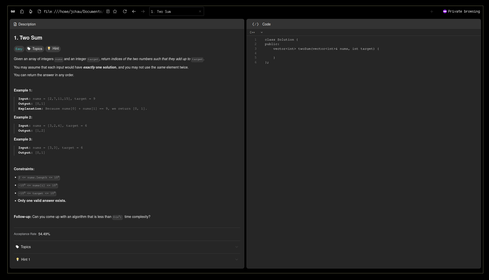

# leet2go

A simple LeetCode problem scraper for offline LeetCoding, written in Golang!

> [!WARNING]
> This is still in development.
> I am also still learning a few things, use at your own risk.

# Motivation

I have a confession: I don’t particularly enjoy LeetCoding. But let’s be real—it’s one of those things I’ll inevitably have to tackle someday.

So, why not make the experience a little more bearable? My plan: build a web scraper that fetches all the problems from LeetCode and organizes them neatly for **offline** use.
That way, when the _dreaded day_ arrives, I’ll be prepared!

...Alright, maybe I’m procrastinating a bit, but there are some genuine motivations behind this project:

1. I wanted to dive deeper into the world of web scrapers and web crawlers to understand how they work under the hood.
2. I’m planning to travel soon, and having problems available offline means I can stay productive even on a long flight with no internet.
3. For fun! Golang has been a joy to work with, and this project gives me a chance to experiment and build something cool!

# How to Use

> [!WARNING]
> You will need to change the source code since I have not gone around making values configurable via CLI parameters or config files just yet.
> Specifically, the values that should be adjusted are currently in `./internal/scraper/constant.go`.
> Simply change the values as needed, then re-build the binary before running it.

## Requirements

- go (I use version 1.23)
- make \[optional\]

## Build & Run

```bash
# using make
make build && make run # or simply `make`

# ...or using go
go build leet2go ./cmd/scraper
./leet2go
```

The result of the above commands will fetch all non-premium LeetCode questions and store them neatly in HTML files that look like this:



> [!NOTE]
> There are currently no way to query _only_ certain questions or premium ones for now.
> Also worth noting that the HTML files will not be overwritten if they already exist (will be a parameter).

## Parameters

These are the values that have worked the best for me so far. I used `MAX_GO_ROUTINES = 69` <sub>nice</sub> because there are currently ~3400 questions on LeetCode and I wanted to "mimick" a
"<https://leetcode.com/problemset/>" load, where a user queries 50 questions at once. `3400 / 69 ~= 50`, so yeah.

It is still pretty random because I am using free proxies and they seemingly vary A LOT on how they perform, which means that you might have to re-run the code a couple times
before you are able to get ALL (except premium) LeetCode questions on your local machine. You could increase the `HTTP_TIMEOUT`, `MAX_RETRY` and the `timeout` parameter in `PROXIES_API_URL` to increase
success chances, but it may take WAYYY longer for the program to finish.

The other noteworthy parameters are `DEFAULT_LANG`, `QUESTIONS_OUTPUT_DIR` and `DEFAULT_USER_AGENT`. They are pretty self-explanatory.

If you don't want to use proxies, you can simply set `USE_PROXY` to `false` and use a small value for `MAX_GO_ROUTINES` (5-10 should be safe). It's _a lot_ more reliable **and** way faster.

```go
// defines the maximum number of concurrent go routines
// this affects leetcode questions query and output file writes
// this also consequently loosely represent req/s
const MAX_GO_ROUTINES = 69

// proxies should in theory protect against IP bans, but it seems like they're not reliable (at least the free ones)
// anyways, for this leetcode in specific, it probably doesn't matter since we don't need that many queries
const USE_PROXY = true

// http client timeout parameter
const HTTP_TIMEOUT = 10 * time.Second

// some proxies can cause timeouts, gateway errors, etc, so having a retry mechanism is useful
const MAX_RETRY = 5

// urls for proxies and leetcode-related queries
// take particular notice to the parameters of the proxy url
const (
 PROXIES_API_URL = "https://api.proxyscrape.com/v2/?request=displayproxies&protocol=http&timeout=1000&country=us,ca&ssl=all&anonymity=elite"
 LEETCODE_URL    = "https://leetcode.com/graphql/"
)

// where the html files of the leetcode problems will be stored
const QUESTIONS_OUTPUT_DIR = "problems/"

// the graphql queries for leetcode-related queries
const (
 QUESTIONS_COUNT_QUERY_STRING = "query problemsetQuestionList($categorySlug:String,$filters:QuestionListFilterInput){problemsetQuestionList:questionList(categorySlug:$categorySlug filters:$filters) {total:totalNum}}"
 QUESTIONS_QUERY_STRING       = "query problemsetQuestionList($categorySlug:String,$limit:Int,$skip:Int,$filters:QuestionListFilterInput){ problemsetQuestionList:questionList( categorySlug:$categorySlug limit:$limit skip:$skip filters:$filters){ questions:data{ frontendQuestionId:questionFrontendId titleSlug title difficulty acRate hints topicTags{name} codeDefinition content}}}"
)

// in case we don't define a user-agents.txt
const DEFAULT_USER_AGENT = "Mozilla/5.0 (Windows NT 10.0; Win64; x64) AppleWebKit/537.36 (KHTML, like Gecko) Chrome/131.0.0.0 Safari/537.36"

// default language
const DEFAULT_LANG = "python"
```

# How It Works

Turns out we don't need to do much scraping since all the information can all be access via POST `https://leetcode.com/graphql/` requests.

There is some formatting here and there, but the responses come back in JSON format.

## Steps

### 1. Find the total number of problems available on LeetCode

We need the total number of problems to determine how we split our requests to minimize wait times.

Below would be the body of the request.

```JSON
{
  "query": "query problemsetQuestionList($categorySlug:String,$filters:QuestionListFilterInput){problemsetQuestionList:questionList(categorySlug:$categorySlug\nfilters:$filters) {total:totalNum}}",
  "variables": {
    "categorySlug": "all-code-essentials",
    "filters": {}
  },
  "operationName": "problemsetQuestionList"
}
```

Sample response:

```JSON
{
    "data": {
        "problemsetQuestionList": {
            "total": 3400
        }
    }
}
```

So we get the number of questions from `data.problemsetQuestionList.total`.

### 2. Get metadata of all problems

We use the same endpoint as above, but we pass different variables in the body.

- `skip`: offset number
  - I am assuming this is used for pagination normally, but we'll also need this to parallelism.
- `limit`: number of problems queried
  - Same as above, we'll need to this for parallelism.

> [!NOTE]
> To query all 3400 LeetCode problems (currently), the request seems to take 12-17s and is about 1.5MB in size.
> We should leverage parallelism as much as possible.
> The more requests we make in parallel, the faster the operation is, but also the more likely we get IP banned.
> Maybe try 10 requests in parallel, which should make it so that it takes 1-2s total to do the same thing.

```JSON
{
  "query": "query problemsetQuestionList($categorySlug:String,$limit:Int,$skip:Int,$filters:QuestionListFilterInput){problemsetQuestionList:questionList(categorySlug:$categorySlug \n limit:$limit \n skip: $skip \n filters:$filters){questions:data{frontendQuestionId:questionFrontendId \n titleSlug \n title \n difficulty \n acRate \n hints \n topicTags{name} \n codeDefinition \n content}}}",
  "variables": {
    "categorySlug": "all-code-essentials",
    "skip": 0,
    "limit": 3400,
    "filters": {}
  },
  "operationName": "problemsetQuestionList"
}

```

Sample response:

```JSON
{
    "data": {
        "problemsetQuestionList": {
            "questions": [
                {
                    "frontendQuestionId": "1",
                    "titleSlug": "two-sum",
                    "title": "Two Sum",
                    "difficulty": "Easy",
                    "acRate": 54.49205508831789,
                    "hints": [
                        "A really brute force way would be to search for all possible pairs of numbers but that would be too slow. Again, it's best to try out brute force solutions for just for completeness. It is from these brute force solutions that you can come up with optimizations.",
                        "So, if we fix one of the numbers, say <code>x</code>, we have to scan the entire array to find the next number <code>y</code> which is <code>value - x</code> where value is the input parameter. Can we change our array somehow so that this search becomes faster?",
                        "The second train of thought is, without changing the array, can we use additional space somehow? Like maybe a hash map to speed up the search?"
                    ],
                    "topicTags": [
                        {
                            "name": "Array"
                        },
                        {
                            "name": "Hash Table"
                        }
                    ],
                    "codeDefinition": "[{\"value\": \"cpp\", \"text\": \"C++\", \"defaultCode\": \"class Solution {\\npublic:\\n    vector<int> twoSum(vector<int>& nums, int target) {\\n        \\n    }\\n};\"}, {\"value\": \"java\", \"text\": \"Java\", \"defaultCode\": \"class Solution {\\n    public int[] twoSum(int[] nums, int target) {\\n        \\n    }\\n}\"}, {\"value\": \"python\", \"text\": \"Python\", \"defaultCode\": \"class Solution(object):\\n    def twoSum(self, nums, target):\\n        \\\"\\\"\\\"\\n        :type nums: List[int]\\n        :type target: int\\n        :rtype: List[int]\\n        \\\"\\\"\\\"\\n        \"}, {\"value\": \"python3\", \"text\": \"Python3\", \"defaultCode\": \"class Solution:\\n    def twoSum(self, nums: List[int], target: int) -> List[int]:\\n        \"}, {\"value\": \"c\", \"text\": \"C\", \"defaultCode\": \"/**\\n * Note: The returned array must be malloced, assume caller calls free().\\n */\\nint* twoSum(int* nums, int numsSize, int target, int* returnSize) {\\n    \\n}\"}, {\"value\": \"csharp\", \"text\": \"C#\", \"defaultCode\": \"public class Solution {\\n    public int[] TwoSum(int[] nums, int target) {\\n        \\n    }\\n}\"}, {\"value\": \"javascript\", \"text\": \"JavaScript\", \"defaultCode\": \"/**\\n * @param {number[]} nums\\n * @param {number} target\\n * @return {number[]}\\n */\\nvar twoSum = function(nums, target) {\\n    \\n};\"}, {\"value\": \"typescript\", \"text\": \"TypeScript\", \"defaultCode\": \"function twoSum(nums: number[], target: number): number[] {\\n    \\n};\"}, {\"value\": \"php\", \"text\": \"PHP\", \"defaultCode\": \"class Solution {\\n\\n    /**\\n     * @param Integer[] $nums\\n     * @param Integer $target\\n     * @return Integer[]\\n     */\\n    function twoSum($nums, $target) {\\n        \\n    }\\n}\"}, {\"value\": \"swift\", \"text\": \"Swift\", \"defaultCode\": \"class Solution {\\n    func twoSum(_ nums: [Int], _ target: Int) -> [Int] {\\n        \\n    }\\n}\"}, {\"value\": \"kotlin\", \"text\": \"Kotlin\", \"defaultCode\": \"class Solution {\\n    fun twoSum(nums: IntArray, target: Int): IntArray {\\n        \\n    }\\n}\"}, {\"value\": \"dart\", \"text\": \"Dart\", \"defaultCode\": \"class Solution {\\n  List<int> twoSum(List<int> nums, int target) {\\n    \\n  }\\n}\"}, {\"value\": \"golang\", \"text\": \"Go\", \"defaultCode\": \"func twoSum(nums []int, target int) []int {\\n    \\n}\"}, {\"value\": \"ruby\", \"text\": \"Ruby\", \"defaultCode\": \"# @param {Integer[]} nums\\n# @param {Integer} target\\n# @return {Integer[]}\\ndef two_sum(nums, target)\\n    \\nend\"}, {\"value\": \"scala\", \"text\": \"Scala\", \"defaultCode\": \"object Solution {\\n    def twoSum(nums: Array[Int], target: Int): Array[Int] = {\\n        \\n    }\\n}\"}, {\"value\": \"rust\", \"text\": \"Rust\", \"defaultCode\": \"impl Solution {\\n    pub fn two_sum(nums: Vec<i32>, target: i32) -> Vec<i32> {\\n        \\n    }\\n}\"}, {\"value\": \"racket\", \"text\": \"Racket\", \"defaultCode\": \"(define/contract (two-sum nums target)\\n  (-> (listof exact-integer?) exact-integer? (listof exact-integer?))\\n  )\"}, {\"value\": \"erlang\", \"text\": \"Erlang\", \"defaultCode\": \"-spec two_sum(Nums :: [integer()], Target :: integer()) -> [integer()].\\ntwo_sum(Nums, Target) ->\\n  .\"}, {\"value\": \"elixir\", \"text\": \"Elixir\", \"defaultCode\": \"defmodule Solution do\\n  @spec two_sum(nums :: [integer], target :: integer) :: [integer]\\n  def two_sum(nums, target) do\\n    \\n  end\\nend\"}]",
                    "content": "<p>Given an array of integers <code>nums</code>&nbsp;and an integer <code>target</code>, return <em>indices of the two numbers such that they add up to <code>target</code></em>.</p>\n\n<p>You may assume that each input would have <strong><em>exactly</em> one solution</strong>, and you may not use the <em>same</em> element twice.</p>\n\n<p>You can return the answer in any order.</p>\n\n<p>&nbsp;</p>\n<p><strong class=\"example\">Example 1:</strong></p>\n\n<pre>\n<strong>Input:</strong> nums = [2,7,11,15], target = 9\n<strong>Output:</strong> [0,1]\n<strong>Explanation:</strong> Because nums[0] + nums[1] == 9, we return [0, 1].\n</pre>\n\n<p><strong class=\"example\">Example 2:</strong></p>\n\n<pre>\n<strong>Input:</strong> nums = [3,2,4], target = 6\n<strong>Output:</strong> [1,2]\n</pre>\n\n<p><strong class=\"example\">Example 3:</strong></p>\n\n<pre>\n<strong>Input:</strong> nums = [3,3], target = 6\n<strong>Output:</strong> [0,1]\n</pre>\n\n<p>&nbsp;</p>\n<p><strong>Constraints:</strong></p>\n\n<ul>\n\t<li><code>2 &lt;= nums.length &lt;= 10<sup>4</sup></code></li>\n\t<li><code>-10<sup>9</sup> &lt;= nums[i] &lt;= 10<sup>9</sup></code></li>\n\t<li><code>-10<sup>9</sup> &lt;= target &lt;= 10<sup>9</sup></code></li>\n\t<li><strong>Only one valid answer exists.</strong></li>\n</ul>\n\n<p>&nbsp;</p>\n<strong>Follow-up:&nbsp;</strong>Can you come up with an algorithm that is less than <code>O(n<sup>2</sup>)</code><font face=\"monospace\">&nbsp;</font>time complexity?"
                },
                ...
            ]
        }
    }
}
```

So we get the list of slugs based on `data.problemsetQuestionList.questions`. ~~We'll need to filter out the `paidOnly = true` because we don't have premium~~ If `"content": null`, then it's a premium problem.

### 4. Create HTML files per problem

We'll name the files as follow: `{frontendQuestionId}.{titleSlug}.html`

The title of the page will be `{title}`, or `{frontendQuestionId}. {title}`.

The problem description will be defined `content` and the difficulty will be defined by `difficulty`.

The topics and hints will be shown if `hints` and `topicTags` are available.

The starting code snippet will be defined by `codeDefinition`. Each element is the code snippet for a certain language. LeetCode assigns an index to each, e.g. 0 is C++ while 2 is Python, but
I don't think I have a reason to leverage that right now. It might be useful information if I ever ping other endpoints.

Note to self, I need to make sure that I preserve the spacing for elements in `codeDefinition` so that I can maintain the indentations.

We can then feed all of these data points into an HTML template with something like the [`html/template`](https://pkg.go.dev/html/template) package.

### 5. Serve files (optional)

We need to make these files accessible to the user somehow. Sure, they could simply open the HTML files manually on their browser, but that's not cool, is it?

There are a few options to deal with this:

- ~~Simple static file server~~
  - ~~This is a simple approach, but wouldn't bring anything valuable to the user; it's just a file explorer with the extra step of running a server.~~
  - A browser can natively do this, just navigate to the file path on your browser!
- Simple "home page" web app + HTML template for question view <- this project is going down this path
  - This can be a very simple HTML home page that allows the users to search for their problems, and some basic features.
- Build a slightly more complex web app using a framework
  - This will allow for cool visuals and more interactiveness.
  - Allow to run code ???
  - This could be a completely separate project!

# Roadmap

Here's a short list of what I still have planned, or am thinking about for this project:

- [ ] Output JSON files as well
- [ ] Give option to download images from description locally
- [ ] A simple "Home Page" to navigate, filter, and search the local files
- [ ] Add basic syntax highlighting
- [ ] CLI parameters
- [ ] Explore how to scrape questions by id or name
- [ ] Explore how to scrape test cases (if so, add them to HTML template)
- [ ] Explore if fetching premium questions is possible with a premium account
- [ ] Add some code editor
  - will most likely be spin-off project of its own
